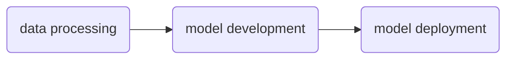

# NeMo Lab

NeMo Lab is an example template for Generative AI with language models using [NVIDIA NeMo](https://www.nvidia.com/en-us/ai-data-science/products/nemo/).

[NVIDA NeMo](https://www.nvidia.com/en-us/ai-data-science/products/nemo/) is an accelerated end-to-end platform that is flexible and production ready. NeMo is comprised of several component frameworks which enable teams to build, customize, and deploy Generative AI solutions for:

- large language models
- vision language models
- video models
- speech models

# Concepts

NeMo Lab is inspired by [NeMo tutorials](https://docs.nvidia.com/nemo-framework/user-guide/latest/nemotoolkit/starthere/tutorials.html) and [`openhackathons-org/End-to-End-LLM`](https://github.com/openhackathons-org/End-to-End-LLM), of which the later follows the below shown pipeline for instruction tuning and deploying a Llama variant:

## Data Processing

We will use the [openassistant-guanaco](https://huggingface.co/datasets/timdettmers/openassistant-guanaco) dataset for instruction tuning. The dataset will be processed according to the procedure shown in [`openhackathons-org/End-to-End-LLM`](https://github.com/openhackathons-org/End-to-End-LLM).

> [!NOTE]
> Refer to the [data processing tutorial](./docs/1-data-processing.md) for a detailed walk-through.

## Model Development

We will use NeMo to tune a Llama variant on the instruction tuning dataset.

> [!NOTE]
> Refer to the [model development tutorial](./docs/2-model-development.md) for a detailed walk-through.

## Model Deployment

We will use [TensorRT-LLM](https://github.com/NVIDIA/TensorRT-LLM) and [Triton Inference Server](https://github.com/triton-inference-server/server) to deploy the tuned model.

> [!NOTE]
> Refer to the [model deployment tutorial](./docs/3-model-deployment.md) for a detailed walk-through.

## Additional Concepts

- Code profiling with [NVIDIA NSight](https://developer.nvidia.com/nsight-systems)
- Model output control with [NeMo Guardrails](https://github.com/NVIDIA/NeMo-Guardrails)
- LLM Traces with [LangSmith](https://www.langchain.com/langsmith)
- Containerization with Docker
- System prompt design
- Experiment management with Weights & Biases

# Repo Architecture

The architecture is meant to provide an entrypoint to a relatively wide breadth of concepts, though at a high level.

The repo architecture aids in use of scripts and configs that leverage the source package `src/nemo_lab`. Similar design patterns can be found in NeMo, and other repos that have to do with language model experimentation and inferencing. Adhering to this unwritten convention should aid in the engineer's understanding of any project that follows such a pattern.

Additionally, the design should aid notebook-bound learners to segue into becoming more comfortable with skills associated with software engineering principles – notably, module cohesion, code quality, python packaging, and containerization and virtualization.

Rather than provide a series of notebooks to cover concepts, the source module is paired with several tutorials found in `docs`. This will allow the engineer to better familiarize with the source code of `nemo_lab` and associated scripts, and to explain rationale behind such topics as using yaml for configs and toml for prompt files, and complementary tools for experimentation management and trace logging.

# System Requirements

- A Linux distro
- CUDA compatible device (GPU) with at least 16GB of VRAM (e.g. a T4 (Colab), or RTX 3090).
- [Docker](https://docs.docker.com/)

# User Account Requirements

- [NVIDIA Developer Progam](https://developer.nvidia.com/developer-program)
- [NVIDIA NGC](https://catalog.ngc.nvidia.com/) for NeMo and TensorRT-LLM containers
- [build.nvidia.com](https://build.nvidia.com/) for API calls to NVIDIA hosted endpoints
- [Hugging Face Hub](https://huggingface.co/) for model weights and datasets
- [LangChain](https://www.langchain.com/) for LangSmith
- [Weights and Biases](https://wandb.ai/site) for experiment management during finetuning

# Resources

## Framework References

- [NeMo documentation](https://docs.nvidia.com/nemo-framework/user-guide/latest/overview.html)
- [NeMo tutorials](https://docs.nvidia.com/nemo-framework/user-guide/latest/nemotoolkit/starthere/tutorials.html)
- [NeMo Guardrails documentation](https://docs.nvidia.com/nemo/guardrails/index.html)
- [NVIDIA NIM (LLM) documentation](https://docs.nvidia.com/nim/large-language-models/latest/introduction.html)
- [langchain-nvidia-ai-endpoints documentation](https://python.langchain.com/docs/integrations/providers/nvidia/)

## NVIDIA Deep Learning Institute

- [Generative AI Explained](https://learn.nvidia.com/courses/course-detail?course_id=course-v1:DLI+S-FX-07+V1)
- [Deploying a Model for Inference at Production Scale](https://learn.nvidia.com/courses/course-detail?course_id=course-v1:DLI+S-FX-03+V1)
- [Sizing LLM Inference Systems](https://learn.nvidia.com/courses/course-detail?course_id=course-v1:DLI+S-FX-18+V1)
- [Building RAG Agents with LLMs](https://learn.nvidia.com/courses/course-detail?course_id=course-v1:DLI+S-FX-15+V1)
- [Introduction to Deploying RAG Pipelines for Production at Scale](https://learn.nvidia.com/courses/course-detail?course_id=course-v1:DLI+S-FX-19+V1)

## NVIDIA On-Demand

- [Generative AI and LLMs](https://www.nvidia.com/en-us/on-demand/playlist/playList-c4975714-66b6-4e95-afc9-c1274a98b8e7/?ncid=em-even-256154&nvweb_e=MasbaNbcu3IbwKJNe4R_xbgjNSDB1FtQ2FYbeOTO3_T3kcNYhShm3fRsakNiPHEdrjRkjCuMO0jqS19pDoOdVA&mkt_tok=MTU2LU9GTi03NDIAAAGWq5H0zvfrnZSnvTIz4p04UXnj-64F7S9iQCHtLE4D7tN0Q-46pfULxcobfKLG8h6yVyOEdc3RCoFNwUqxNYpcTzgmavtcXv5POiw88JXk86AwqKIpbQY)
- [Accelerated LLM Model Alignment and Deployment](https://www.nvidia.com/en-us/on-demand/session/gtc24-dlit61739/)
- [Beyond RAG Basics: Building Agents, Co-Pilots, Assistants, and More!](https://www.nvidia.com/en-us/on-demand/session/gtc24-s62533/?ncid=em-nurt-357883&mkt_tok=MTU2LU9GTi03NDIAAAGWcw69qcOLICDwzc5k1q4fHjE99s7tpt355Ckin2E7NvN0R9_19wuU_65jAp4CubV85JY-DRDMEFXuFo0ek6nPExWYghHfPtB2m9B2IrFeFeyeE4BuYNI)
- [Generative AI Essentials](https://www.nvidia.com/en-us/ai-data-science/generative-ai/video-sessions-accelerated-development/?ncid=em-nurt-269499&mkt_tok=MTU2LU9GTi03NDIAAAGWcw69qam-BVUHdn8F4tVRrNIwk13Zq9Bjwt4BmoQizeMT-UpE0bX7CF9oYjPpT_JyzEu7k-EhtkJrY4NGI6szhS6F58MX58c2tXZulioli0OCNC5dO-o)
- [GTC 2024 - Latest in Generative AI](https://www.nvidia.com/en-us/on-demand/playlist/playList-4f66703b-30b6-4b46-b906-8d18623360ba/?ncid=em-nurt-508206&mkt_tok=MTU2LU9GTi03NDIAAAGWcw69qXvl-vMKaHc2mv2rUhRH2GMhdXxtd7ACJV5dQDxhWqmDj7okkXie55OK8wFOgRXUq2OQCWvBe3TJvNxQdnRFxYdY0PygnXhqVHu_vFA6vDWiDno)