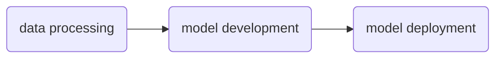

# NeMo Lab

> [!IMPORTANT]
> NeMo Lab is under active development

NeMo Lab is an example template for Generative AI with [NVIDIA NeMo 2.0](https://www.nvidia.com/en-us/ai-data-science/products/nemo/).

[NVIDA NeMo](https://www.nvidia.com/en-us/ai-data-science/products/nemo/) is an accelerated end-to-end platform that is flexible and production ready. NeMo is comprised of several component frameworks which enable teams to build, customize, and deploy Generative AI solutions for:

- large language models
- vision language models
- video models
- speech models

> [!TIP]
> Get started with the quick start [tutorials](docs/tutorials/quickstarts) and [scripts](scripts/tutorials/nemo)

# Tutorial Concepts

NeMo Lab is inspired by [`NeMo tutorials`](https://docs.nvidia.com/nemo-framework/user-guide/latest/nemotoolkit/starthere/tutorials.html) and [`openhackathons-org/End-to-End-LLM`](https://github.com/openhackathons-org/End-to-End-LLM); of which the later follows the below shown pipeline to guide hackathon participants through instruction tuning and deploying a Llama variant:



NeMo Lab currently focuses on language models, and will expand into NeMo audio, vision, and multimodal capabilities when appropriate. 

## Data Processing

Data processing is task dependent, relative to pretraining or finetuning. When pretraining, we will use Hugging Face's [cosmopedia](https://huggingface.co/datasets/HuggingFaceTB/cosmopedia) dataset. When finetuning, we will use NeMo's default dataset – `SquadDataModule` – a variant of the [Stanford QA dataset](https://huggingface.co/datasets/nvidia/ChatQA-Training-Data/viewer/squad2.0). 

> [!NOTE]
> Refer to the [data processing tutorial](./docs/tutorials/1-data-processing.md) for a detailed walk-through

## Model Development

We will use NeMo to train Nemotron 3 4B on the cosmopedia dataset, and tune a Llama variant on the SQuAD dataset.

> [!NOTE]
> Refer to the [model development tutorial](./docs/tutorials/2-model-development.md) for a detailed walk-through

## Model Deployment

We will use NeMo interfaces to export models for inference with [TensorRT-LLM](https://github.com/NVIDIA/TensorRT-LLM) and [Triton Inference Server](https://github.com/triton-inference-server/server), or [vLLM](https://github.com/vllm-project/vllm).

> [!NOTE]
> Refer to the [model deployment tutorial](./docs/tutorials/3-model-deployment.md) for a detailed walk-through

## Additional Concepts

- Code profiling
- Logging training and tuning runs with [Weights & Biases](https://wandb.ai/site)
- Model output control with [NeMo Guardrails](https://github.com/NVIDIA/NeMo-Guardrails)
- LLM traces with [Arize](https://arize.com/)
- Agents as DAGs with [LangGraph](https://www.langchain.com/langgraph)
- Containerization with Docker
- System prompt design

# Source Code Concepts

The source code found in `src/nemo_lab` is used to provide examples of implementing concepts "from-scratch" with NeMo. For instance – how might we add a custom model, or our own training recipe given base interfaces and mixins found within the framework.

> [!NOTE]
> The current focus for the source code is implementing support for Llama 3.2 variants

# Models

We will use NVIDIA and Meta models including, but not limited to:

- NVIDIA Llama variants, Mistral variants, Megatron distillations, and Minitron
- NVIDIA embedding, reranking, and retrieval models
- NVIDIA Cosmos tokenizers
- NeMo compatible Meta Llama variants

> [!TIP]
> See [models/](docs/conceptual-guides/models/) for more on model families and types

# System Requirements

- a CUDA compatible OS and device (GPU) with at least 48GB of VRAM (e.g. an L40S).
- CUDA 12.1
- Python 3.10.10
- Pytorch 2.2.1

> [!TIP]
> See [hardware/](docs/conceptual-guides/hardware/) for more regarding VRAM requirements of particular models

# User Account Requirements

- [NVIDIA Developer Program](https://developer.nvidia.com/developer-program)
- [NVIDIA NGC](https://catalog.ngc.nvidia.com/) for NeMo and TensorRT-LLM containers
- [build.nvidia.com](https://build.nvidia.com/) for API calls to NVIDIA hosted endpoints
- [Hugging Face Hub](https://huggingface.co/) for model weights and datasets
- [Arize](https://arize.com/) for tracing and observability
- [Weights & Biases](https://wandb.ai/site) for experiment management during finetuning

# Setup

> [!TIP]
> Get started with the quick start [tutorials](docs/tutorials/quickstarts) and [scripts](scripts/tutorials/nemo)

## On Host (local, no container)

To prepare a development environment, please run the following in terminal:

```sh
bash install_requirements.sh
```

Doing so will install `nemo_lab` along with the `nemo_run`, `megatron_core 0.10.0rc0`, and the `nvidia/apex` PyTorch extension. 

> [!NOTE]
> `megatron_core 0.10.0rc0` is required for compatibility with NeMo 2.0

> [!NOTE]
> NVIDIA Apex is required for RoPE Scaling in NeMo 2.0.
> NVIDIA Apex is built with CUDA and C++ extensions for performance and full functionality.
> please be aware that the build process may take several minutes

## Docker

Two Docker images have been created for the quick start tutorials. One for pretraining, and one for finetuning.

To run pretraining, do the following in terminal:

```sh
docker pull jxtngx/nemo-pretrain-nemotron3-4b
docker run --rm --gpus 1 -it jxtngx/nemo-pretrain-nemotron3-4b
python pretrain_nemotron3_4b.py
```

To run finetuning, do the following in terminal:

```sh
docker pull docker pull jxtngx/nemo-finetune-llama3-8b
docker run --rm --gpus 1 -it docker jxtngx/nemo-finetune-llama3-8b
huggingface-cli login
{ENTER HF KEY WHEN PROMPTED}
python finetune_llama3_8b.py
```

> [!IMPORTANT]
> Finetuning requires a Hugging Face key and access to Llama 3 8B <br>
> For keys, see: https://huggingface.co/docs/hub/en/security-tokens <br>
> For Llama 3 8B access, see: https://huggingface.co/meta-llama/Meta-Llama-3-8B

## Hosted Compute Environments

See [Quickstart Studios and Images](#Quickstart-Studios-and-Images)

# Resources

## Quickstart Studios and Images

<table>
    <tr>
        <th>Quickstart</th>
        <th>Studio</th>
        <th>Docker</th>
    </tr>
    <tr>
        <td>Pretrain Nemotron 3 4B</td>
        <td><a target="_blank" href="https://lightning.ai/jxtngx/studios/pretrain-nemotron-3-4b-with-nvidia-nemo"></a></td>
        <td><a target="_blank" href="https://hub.docker.com/r/jxtngx/nemo-pretrain-nemotron3-4b"></a></td>
    </tr>
    <tr>
        <td>Finetune Llama 3 8B</td>
        <td><a target="_blank" href="https://lightning.ai/jxtngx/studios/finetune-llama-3-8b-with-nvidia-nemo"></a></td>
        <td><a target="_blank" href="https://hub.docker.com/r/jxtngx/nemo-finetune-llama3-8b"></a></td>
    </tr>
</table>

## NeMo References

- [NeMo documentation](https://docs.nvidia.com/nemo-framework/user-guide/latest/overview.html)
- [NeMo tutorials](https://docs.nvidia.com/nemo-framework/user-guide/latest/nemotoolkit/starthere/tutorials.html)
- [NeMo Guardrails documentation](https://docs.nvidia.com/nemo/guardrails/index.html)
- [Deploy on a SLURM cluster](https://docs.nvidia.com/nemo-framework/user-guide/latest/nemo-2.0/quickstart.html#execute-on-a-slurm-cluster)
- [Mixed Precision Training](https://docs.nvidia.com/nemo-framework/user-guide/latest/nemotoolkit/features/mixed_precision.html)
- [CPU Offloading](https://docs.nvidia.com/nemo-framework/user-guide/latest/nemotoolkit/features/optimizations/cpu_offloading.html)
- [Communication Overlap](https://docs.nvidia.com/nemo-framework/user-guide/latest/nemotoolkit/features/optimizations/communication_overlap.html)

## Dependency References
- [NVIDIA NIM (LLM) documentation](https://docs.nvidia.com/nim/large-language-models/latest/introduction.html)
- [langchain-nvidia-ai-endpoints documentation](https://python.langchain.com/docs/integrations/providers/nvidia/)
- [Arize documentation](https://docs.arize.com/arize)
- [LangGraph documentation](https://langchain-ai.github.io/langgraph/tutorials/introduction/)
- [W&B documentation](https://docs.wandb.ai/ref/python/)
- [vLLM documentation](https://docs.vllm.ai/en/latest/)
- [cuVS](https://docs.rapids.ai/api/cuvs/stable/) (GPU accelerated vector search by NVIDIA Rapids)
- [Weaviate documentation](https://weaviate.io/developers/weaviate)
- [Gradio documentation](https://www.gradio.app/docs)

## Interoperability Guides

- [Arize and LangGraph](https://arize.com/blog/langgraph/) (Arize)
- [Weaviate and LangChain](https://python.langchain.com/docs/integrations/vectorstores/weaviate/) (LangChain)
- [vLLM and LangChain](https://python.langchain.com/docs/integrations/llms/vllm/) (LangChain)

## NVIDIA Deep Learning Institute

- [Generative AI Explained](https://learn.nvidia.com/courses/course-detail?course_id=course-v1:DLI+S-FX-07+V1)
- [Deploying a Model for Inference at Production Scale](https://learn.nvidia.com/courses/course-detail?course_id=course-v1:DLI+S-FX-03+V1)
- [Sizing LLM Inference Systems](https://learn.nvidia.com/courses/course-detail?course_id=course-v1:DLI+S-FX-18+V1)
- [Building RAG Agents with LLMs](https://learn.nvidia.com/courses/course-detail?course_id=course-v1:DLI+S-FX-15+V1)
- [Introduction to Deploying RAG Pipelines for Production at Scale](https://learn.nvidia.com/courses/course-detail?course_id=course-v1:DLI+S-FX-19+V1)
- [Prompt Engineering with LLaMA-2](https://learn.nvidia.com/courses/course-detail?course_id=course-v1:DLI+S-FX-12+V1)

## NVIDIA On-Demand

- [Generative AI and LLMs](https://www.nvidia.com/en-us/on-demand/playlist/playList-c4975714-66b6-4e95-afc9-c1274a98b8e7/?ncid=em-even-256154&nvweb_e=MasbaNbcu3IbwKJNe4R_xbgjNSDB1FtQ2FYbeOTO3_T3kcNYhShm3fRsakNiPHEdrjRkjCuMO0jqS19pDoOdVA&mkt_tok=MTU2LU9GTi03NDIAAAGWq5H0zvfrnZSnvTIz4p04UXnj-64F7S9iQCHtLE4D7tN0Q-46pfULxcobfKLG8h6yVyOEdc3RCoFNwUqxNYpcTzgmavtcXv5POiw88JXk86AwqKIpbQY)
- [Accelerated LLM Model Alignment and Deployment](https://www.nvidia.com/en-us/on-demand/session/gtc24-dlit61739/)
- [Beyond RAG Basics: Building Agents, Co-Pilots, Assistants, and More!](https://www.nvidia.com/en-us/on-demand/session/gtc24-s62533/?ncid=em-nurt-357883&mkt_tok=MTU2LU9GTi03NDIAAAGWcw69qcOLICDwzc5k1q4fHjE99s7tpt355Ckin2E7NvN0R9_19wuU_65jAp4CubV85JY-DRDMEFXuFo0ek6nPExWYghHfPtB2m9B2IrFeFeyeE4BuYNI)
- [Generative AI Essentials](https://www.nvidia.com/en-us/ai-data-science/generative-ai/video-sessions-accelerated-development/?ncid=em-nurt-269499&mkt_tok=MTU2LU9GTi03NDIAAAGWcw69qam-BVUHdn8F4tVRrNIwk13Zq9Bjwt4BmoQizeMT-UpE0bX7CF9oYjPpT_JyzEu7k-EhtkJrY4NGI6szhS6F58MX58c2tXZulioli0OCNC5dO-o)
- [GTC 2024 - Latest in Generative AI](https://www.nvidia.com/en-us/on-demand/playlist/playList-4f66703b-30b6-4b46-b906-8d18623360ba/?ncid=em-nurt-508206&mkt_tok=MTU2LU9GTi03NDIAAAGWcw69qXvl-vMKaHc2mv2rUhRH2GMhdXxtd7ACJV5dQDxhWqmDj7okkXie55OK8wFOgRXUq2OQCWvBe3TJvNxQdnRFxYdY0PygnXhqVHu_vFA6vDWiDno)

## NVIDIA Technical Blog

- [Prompt Engineering and P-Tuning](https://developer.nvidia.com/blog/an-introduction-to-large-language-models-prompt-engineering-and-p-tuning/)
- [Scaling LLMs with NVIDIA Triton and NVIDIA TensorRT-LLM](https://developer.nvidia.com/blog/scaling-llms-with-nvidia-triton-and-nvidia-tensorrt-llm-using-kubernetes/)
- [Turbocharging Meta Llama 3 Performance with NVIDIA TensorRT-LLM and NVIDIA Triton Inference Server](https://developer.nvidia.com/blog/turbocharging-meta-llama-3-performance-with-nvidia-tensorrt-llm-and-nvidia-triton-inference-server/)
- [Post-Training Quantization of LLMs with NVIDIA NeMo and NVIDIA TensorRT Model Optimizer](https://developer.nvidia.com/blog/post-training-quantization-of-llms-with-nvidia-nemo-and-nvidia-tensorrt-model-optimizer/)
- [Getting Started with Large Language Models for Enterprise Solutions](https://developer.nvidia.com/blog/getting-started-with-large-language-models-for-enterprise-solutions/)
- [Unlocking the Power of Enterprise-Ready LLMs with NVIDIA NeMo](https://developer.nvidia.com/blog/unlocking-the-power-of-enterprise-ready-llms-with-nemo/)
- [TensorRT-LLM KV Cache Early Reuse](https://developer.nvidia.com/blog/5x-faster-time-to-first-token-with-nvidia-tensorrt-llm-kv-cache-early-reuse/)
- [An Introduction to Model Merging for LLMs](https://developer.nvidia.com/blog/an-introduction-to-model-merging-for-llms/)


## Academic Papers

- [Neural Machine Translation by Jointly Learning to Align and Translate](https://arxiv.org/abs/1409.0473)
- [Neural GPUs Learn Algorithms](https://arxiv.org/abs/1511.08228)
- [A Structured Self-attentive Sentence Embedding](https://arxiv.org/pdf/1703.03130)
- [Attention is All You Need](https://arxiv.org/abs/1706.03762)
- [Megatron-LM: Training Multi-Billion Parameter Language Models Using Model Parallelism](https://arxiv.org/abs/1909.08053)
- [LLaMA: Open and Efficient Foundation Language Models](https://arxiv.org/abs/2302.13971)
- [The Llama 3 Herd of Models](https://arxiv.org/pdf/2407.21783)
- [Compact Language Models via Pruning and Knowledge Distillation](https://arxiv.org/abs/2407.14679v1)
- [8-bit Optimizers via Block-wise Quantization](https://arxiv.org/abs/2110.02861)
- [FlashAttention: Fast and Memory-Efficient Exact Attention with IO-Awareness](https://arxiv.org/abs/2205.14135)
- [FlashAttention-2: Faster Attention with Better Parallelism and Work Partitioning](https://arxiv.org/abs/2307.08691)
- [FlashAttention-3: Fast and Accurate Attention with Asynchrony and Low-precision](https://arxiv.org/pdf/2407.08608)
- [LoRA: Low-Rank Adaptation of Large Language Models](https://arxiv.org/abs/2106.09685)
- [QLoRA: Efficient Finetuning of Quantized LLMs](https://arxiv.org/abs/2305.14314)
- [RoFormer: Enhanced Transformer with Rotary Position Embedding](https://arxiv.org/abs/2104.09864)
- [Efficient Memory Management for Large Language Model Serving with PagedAttention](https://arxiv.org/pdf/2309.06180)
- [Efficient Tool Use with Chain-of-Abstraction Reasoning](https://arxiv.org/abs/2401.17464)
- [ReAct: Synergizing Reasoning and Acting in Language Models](https://arxiv.org/abs/2210.03629)
- [Adaptive Mixtures of Local Experts](https://www.cs.toronto.edu/~fritz/absps/jjnh91.pdf)

## Additional Materials

- [Build a Large Language Model](https://www.manning.com/books/build-a-large-language-model-from-scratch) (Sebastian Raschka)
- [Hands-On Large Language Models](https://www.oreilly.com/library/view/hands-on-large-language/9781098150952/) (Alammar et al)
- [StatQuest](https://www.youtube.com/@statquest) (Josh Starmer)
- [Coding a ChatGPT Like Transformer From Scratch in PyTorch](https://youtu.be/C9QSpl5nmrY?si=K1vbKeIhbZuhWDu9) (Josh Starmer)
- [Serrano Academy](https://www.youtube.com/@SerranoAcademy) (Luis Serrano)
- [Intro to Large Language Models](https://youtu.be/zjkBMFhNj_g?si=0P7JK2_WB6EV6iBg) (Andrej Karpathy)
- [Building LLMs from the Ground Up](https://youtu.be/quh7z1q7-uc?si=XHoADXdtTc-izVKg) (Sebastian Raschka)
- [Coding the Self-Attention Mechanism of LLMs](https://sebastianraschka.com/blog/2023/self-attention-from-scratch.html) (Sebastian Raschka)
- [Neural networks](https://youtube.com/playlist?list=PLZHQObOWTQDNU6R1_67000Dx_ZCJB-3pi&si=rIh_wk3JmY1x9MIf) (Grant Sanderson)
- [Visualizing Transformers and Attention](https://youtu.be/KJtZARuO3JY?si=yjhZ7An6uigCVeqE) (Grant Sanderson)
- [Agentic Design Patterns](https://www.deeplearning.ai/the-batch/how-agents-can-improve-llm-performance/?ref=dl-staging-website.ghost.io) (Deep Learning AI)
- [Intro to LangGraph](https://academy.langchain.com/courses/intro-to-langgraph) (LangChain)
- [Getting Beyond the Hype: A Guide to AI’s Potential](https://online.stanford.edu/getting-beyond-hype-guide-ais-potential) (Stanford)
