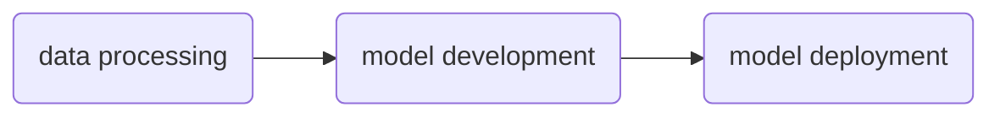

# NeMo Lab

NeMo Lab is an example template for Generative AI with language models using [NVIDIA NeMo 2.0](https://www.nvidia.com/en-us/ai-data-science/products/nemo/).

[NVIDA NeMo](https://www.nvidia.com/en-us/ai-data-science/products/nemo/) is an accelerated end-to-end platform that is flexible and production ready. NeMo is comprised of several component frameworks which enable teams to build, customize, and deploy Generative AI solutions for:

- large language models
- vision language models
- video models
- speech models

> [!IMPORTANT]
> NeMo Lab is under active development

# Concepts

NeMo Lab is inspired by [`NeMo tutorials`](https://docs.nvidia.com/nemo-framework/user-guide/latest/nemotoolkit/starthere/tutorials.html) and [`openhackathons-org/End-to-End-LLM`](https://github.com/openhackathons-org/End-to-End-LLM); of which the later follows the below shown pipeline to guide hackathon participants through instruction tuning and deploying a Llama variant:



> [!NOTE]
> When appropriate, we will use scripts and recipes provided in [NVIDIA/NeMo/scripts](https://github.com/NVIDIA/NeMo/tree/main/scripts)

> [!TIP]
> Get started with the quick start [tutorial](docs/tutorials/llama3-finetuning-quickstart.md) and [script](scripts/tutorials/nemo/llama3-finetuning-quickstart.py)

## Data Processing

We will use a dataset presecribed in the NeMo tutorials for instruction tuning. The dataset will be processed according to the procedure shown in any complementary script or tutorial that accompanies that dataset.

> [!NOTE]
> Refer to the [data processing tutorial](./docs/tutorials/1-data-processing.md) for a detailed walk-through

## Model Development

We will use NeMo to tune a Llama variant on the instruction tuning dataset.

> [!NOTE]
> Refer to the [model development tutorial](./docs/tutorials/2-model-development.md) for a detailed walk-through

## Model Deployment

We will use NeMo interfaces to export models for inference with [TensorRT-LLM](https://github.com/NVIDIA/TensorRT-LLM) and [Triton Inference Server](https://github.com/triton-inference-server/server), or [vLLM](https://github.com/vllm-project/vllm).

> [!NOTE]
> Refer to the [model deployment tutorial](./docs/tutorials/3-model-deployment.md) for a detailed walk-through

## Additional Concepts

- Code profiling with [NVIDIA NSight](https://developer.nvidia.com/nsight-systems)
- Logging training and tuning runs with [Weights & Biases](https://wandb.ai/site)
- Model output control with [NeMo Guardrails](https://github.com/NVIDIA/NeMo-Guardrails)
- LLM traces with [Arize](https://arize.com/)
- Agents as DAGs with [LangGraph](https://www.langchain.com/langgraph)
- Containerization with Docker
- System prompt design

# Models

We will use NVIDIA and Meta models including, but not limited to:

- NVIDIA Llama variants, Mistral variants, Megatron distillations, and Minitron
- NeMo compatible Meta Llama variants
- NVIDIA embedding, reranking, and retrieval models
- NVIDIA Cosmos tokenizers

> [!TIP]
> See [models/](docs/conceptual-guides/models/) for more on model families and types

# System Requirements

- a CUDA compatible OS and device (GPU) with at least 16GB of VRAM (e.g. a T4 (Colab), or RTX 3090).
- [Docker](https://docs.docker.com/)

> [!TIP]
> See [hardware/](docs/conceptual-guides/hardware/) for more regarding VRAM requirements of particular models

# User Account Requirements

- [NVIDIA Developer Program](https://developer.nvidia.com/developer-program)
- [NVIDIA NGC](https://catalog.ngc.nvidia.com/) for NeMo and TensorRT-LLM containers
- [build.nvidia.com](https://build.nvidia.com/) for API calls to NVIDIA hosted endpoints
- [Hugging Face Hub](https://huggingface.co/) for model weights and datasets
- [Arize](https://arize.com/) for tracing and observability
- [Weights & Biases](https://wandb.ai/site) for experiment management during finetuning

## Setup

To prepare a development environment, please run the following in terminal:

```sh
bash install_requirments.sh
```

Doing so will install `nemo_lab` along with the `nemo_run`, `megatron_core 0.10.0rc0`, and the `nvidia/apex` PyTorch extension. 

> [!NOTE]
> `megatron_core 0.10.0rc0` is required for compatibility with NeMo 2.0

> [!NOTE]
> NVIDIA Apex is required for RoPE Scaling in NeMo 2.0.
> NVIDIA Apex is built with CUDA and C++ extensions for performance and full functionality.
> please be aware that the build process may take several minutes

> [!TIP]
> Get started with the quick start [tutorial](docs/tutorials/llama3-finetuning-quickstart.md) and [script](scripts/tutorials/nemo/llama3-finetuning-quickstart.py)

# Resources

## Framework References

- [NeMo documentation](https://docs.nvidia.com/nemo-framework/user-guide/latest/overview.html)
- [NeMo tutorials](https://docs.nvidia.com/nemo-framework/user-guide/latest/nemotoolkit/starthere/tutorials.html)
- [NeMo Guardrails documentation](https://docs.nvidia.com/nemo/guardrails/index.html)
- [NVIDIA NIM (LLM) documentation](https://docs.nvidia.com/nim/large-language-models/latest/introduction.html)
- [langchain-nvidia-ai-endpoints documentation](https://python.langchain.com/docs/integrations/providers/nvidia/)
- [Arize documentation](https://docs.arize.com/arize)
- [LangGraph documentation](https://langchain-ai.github.io/langgraph/tutorials/introduction/)
- [W&B documentation](https://docs.wandb.ai/ref/python/)
- [vLLM documentation](https://docs.vllm.ai/en/latest/)
- [Milvus documentation](https://milvus.io/docs)


## NVIDIA Deep Learning Institute

- [Generative AI Explained](https://learn.nvidia.com/courses/course-detail?course_id=course-v1:DLI+S-FX-07+V1)
- [Deploying a Model for Inference at Production Scale](https://learn.nvidia.com/courses/course-detail?course_id=course-v1:DLI+S-FX-03+V1)
- [Sizing LLM Inference Systems](https://learn.nvidia.com/courses/course-detail?course_id=course-v1:DLI+S-FX-18+V1)
- [Building RAG Agents with LLMs](https://learn.nvidia.com/courses/course-detail?course_id=course-v1:DLI+S-FX-15+V1)
- [Introduction to Deploying RAG Pipelines for Production at Scale](https://learn.nvidia.com/courses/course-detail?course_id=course-v1:DLI+S-FX-19+V1)

## NVIDIA On-Demand

- [Generative AI and LLMs](https://www.nvidia.com/en-us/on-demand/playlist/playList-c4975714-66b6-4e95-afc9-c1274a98b8e7/?ncid=em-even-256154&nvweb_e=MasbaNbcu3IbwKJNe4R_xbgjNSDB1FtQ2FYbeOTO3_T3kcNYhShm3fRsakNiPHEdrjRkjCuMO0jqS19pDoOdVA&mkt_tok=MTU2LU9GTi03NDIAAAGWq5H0zvfrnZSnvTIz4p04UXnj-64F7S9iQCHtLE4D7tN0Q-46pfULxcobfKLG8h6yVyOEdc3RCoFNwUqxNYpcTzgmavtcXv5POiw88JXk86AwqKIpbQY)
- [Accelerated LLM Model Alignment and Deployment](https://www.nvidia.com/en-us/on-demand/session/gtc24-dlit61739/)
- [Beyond RAG Basics: Building Agents, Co-Pilots, Assistants, and More!](https://www.nvidia.com/en-us/on-demand/session/gtc24-s62533/?ncid=em-nurt-357883&mkt_tok=MTU2LU9GTi03NDIAAAGWcw69qcOLICDwzc5k1q4fHjE99s7tpt355Ckin2E7NvN0R9_19wuU_65jAp4CubV85JY-DRDMEFXuFo0ek6nPExWYghHfPtB2m9B2IrFeFeyeE4BuYNI)
- [Generative AI Essentials](https://www.nvidia.com/en-us/ai-data-science/generative-ai/video-sessions-accelerated-development/?ncid=em-nurt-269499&mkt_tok=MTU2LU9GTi03NDIAAAGWcw69qam-BVUHdn8F4tVRrNIwk13Zq9Bjwt4BmoQizeMT-UpE0bX7CF9oYjPpT_JyzEu7k-EhtkJrY4NGI6szhS6F58MX58c2tXZulioli0OCNC5dO-o)
- [GTC 2024 - Latest in Generative AI](https://www.nvidia.com/en-us/on-demand/playlist/playList-4f66703b-30b6-4b46-b906-8d18623360ba/?ncid=em-nurt-508206&mkt_tok=MTU2LU9GTi03NDIAAAGWcw69qXvl-vMKaHc2mv2rUhRH2GMhdXxtd7ACJV5dQDxhWqmDj7okkXie55OK8wFOgRXUq2OQCWvBe3TJvNxQdnRFxYdY0PygnXhqVHu_vFA6vDWiDno)

## Additional Materials

- [Build a Large Language Model, Sebastian Raschka](https://www.manning.com/books/build-a-large-language-model-from-scratch)
- [Hands-On Large Language Models, Alammar et al](https://www.oreilly.com/library/view/hands-on-large-language/9781098150952/)
- [Getting Beyond the Hype: A Guide to AI’s Potential, Stanford](https://online.stanford.edu/getting-beyond-hype-guide-ais-potential)
- [Arize and LangGraph](https://arize.com/blog/langgraph/)
- [Milvus and LangChain](https://milvus.io/docs/integrate_with_langchain.md)
- [vLLM and LangChain](https://python.langchain.com/docs/integrations/llms/vllm/)