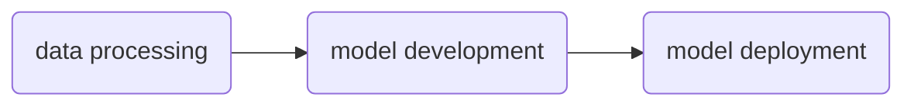

# NeMo Lab

NeMo Lab is an example template for Generative AI with language models using [NVIDIA NeMo](https://www.nvidia.com/en-us/ai-data-science/products/nemo/) (Neural Modules) framework.

[NVIDA NeMo](https://www.nvidia.com/en-us/ai-data-science/products/nemo/) is an accelerated, end-to-end platform that is flexible and production ready. NeMo is comprised of several component frameworks which enable teams to build, customize, and deploy Generative AI solutions for:

- large language models
- vision lanuage models
- video models
- speech models

## Concepts

NeMo Lab is inspired by [`openhackathons-org/End-to-End-LLM`](https://github.com/openhackathons-org/End-to-End-LLM), which follows the below shown pipeline for instruction tuning and deploying a Llama variant:

Where the endstate of the pipeline relies on [TensorRT-LLM]() and [Triton Inference Server]()

## System Requirements

A linux distro and CUDA compatible device with at least 20GB of VRAM (i.e. an A10 or L4, or RTX 4090).